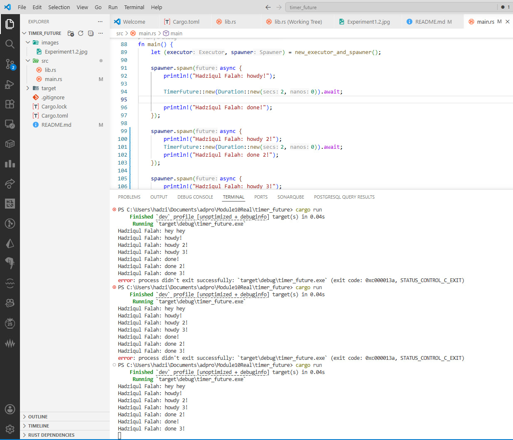

# Tutorial 1 Reflection

### Experiment 1.2: Understanding how it works

When the program is executed, the output "Hadziqul Falah: hey hey" appears before "Hadziqul Falah: howdy!". 
This happens because Rust's futures are lazy and do not execute immediately when they are spawned. 
The `spawner.spawn` call merely packages the async block into a `Task` and sends it to the `ready_queue` channel. 
The `println!` statement that says "hey hey" is a synchronous operation on the main thread, so it executes immediately after the task is sent to the channel. 
The actual execution of the spawned future only begins when `executor.run()` is called, which pulls the task from the channel and polls it. 
Therefore, the executor hasn't even started processing the "howdy!" message by the time the main thread has already printed "hey hey". 
This demonstrates the clear distinction between scheduling a task (spawning) and executing a task (polling via an executor).

### Experiment 1.3: Multiple Spawn and removing drop

Spawning multiple tasks, as seen in this experiment, allows the executor to manage several asynchronous operations concurrently on a single thread. 
The **Spawner** acts as the producer in this system, packaging futures into tasks and sending them into the channel. 
The **Executor** is the consumer that pulls these tasks from the queue and drives them to completion by polling them whenever they are ready to make progress. 
When I commented out the `drop(spawner)` statement, I observed that the program never finishes and remains "hanging" in the terminal even after all tasks are completed. 
This occurs because the `executor.run()` loop relies on the task channel closing to know when to stop receiving. 
Since a copy of the spawner still exists in the `main` function scope, the channel stays open, and the executor continues to wait for new tasks that will never come. 
Dropping the spawner is therefore a crucial signal to the executor that no more tasks will be enqueued, allowing the `while let Ok(task)` loop to terminate naturally. 
In summary, the Spawner feeds the Executor, and the 'drop' provides the necessary exit condition for the entire asynchronous system.
