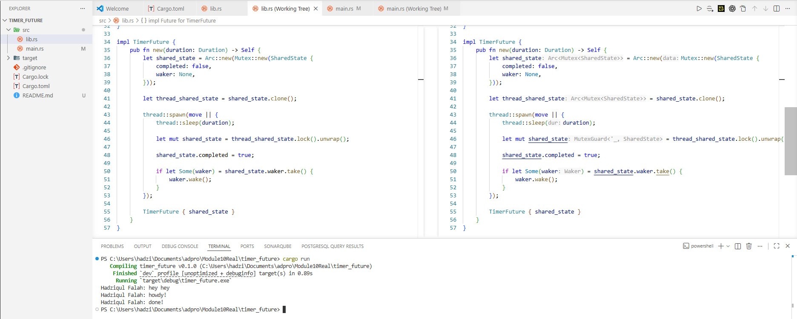

# Tutorial 1 Reflection

### Experiment 1.2: Understanding how it works

When the program is executed, the output "Hadziqul Falah: hey hey" appears before "Hadziqul Falah: howdy!". 
This happens because Rust's futures are lazy and do not execute immediately when they are spawned [7]. 
The `spawner.spawn` call merely packages the async block into a `Task` and sends it to the `ready_queue` channel [8, 9]. 
The `println!` statement that says "hey hey" is a synchronous operation on the main thread, so it executes immediately after the task is sent to the channel [6, 10]. 
The actual execution of the spawned future only begins when `executor.run()` is called, which pulls the task from the channel and polls it [3, 5]. 
Therefore, the executor hasn't even started processing the "howdy!" message by the time the main thread has already printed "hey hey". 
This demonstrates the clear distinction between scheduling a task (spawning) and executing a task (polling via an executor).
